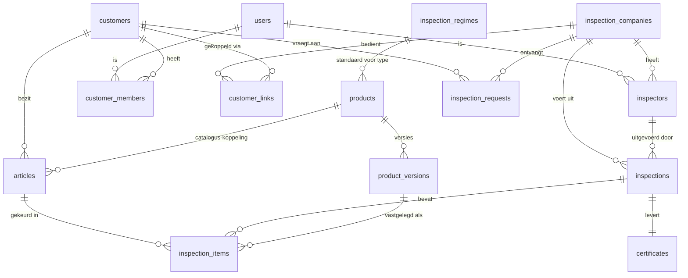

# Datamodel KlimKeur 2.0 — voorstel v1

Hoort bij `BLAUWDRUK.md`. Schema- en kolomnamen in het **Engels** (besloten),
uitleg in het Nederlands. Status: **voorstel, ter bespreking**.

Leeswijzer: `PK` = primary key, `FK →` = verwijzing, `?` = mag leeg zijn.
Elke tabel krijgt standaard `id uuid PK`, `created_at timestamptz` — die
worden hieronder niet herhaald.

---

## Overzicht (ER-diagram)

---

## 1. Identiteit en rollen

### `users`
Profiel bovenop Supabase Auth. Eén persoon = één account, rollen volgen uit
de koppeltabellen (`inspectors`, `customer_members`, `platform_admins`).

| kolom | type | uitleg |
|---|---|---|
| auth_user_id | uuid, uniek | koppeling naar Supabase Auth |
| full_name | text | |
| email | text | |
| phone | text? | |
| locale | text | `nl` / `en-GB` — bepaalt UI-taal |

### `platform_admins`
| kolom | type | uitleg |
|---|---|---|
| user_id | FK → users | jij/platformbeheer; mag alles |

### `inspection_companies` (keurbedrijven, de tenants)
| kolom | type | uitleg |
|---|---|---|
| name | text | |
| country_code | text | `NL` / `GB` — stuurt regime, certificaatteksten, locale-defaults |
| registration_number | text? | KvK / Companies House — label volgt uit country_code |
| address, postal_code, city | text? | |
| email, phone | text? | |
| logo_url, brand_color | text? | branding in klant-app |
| cert_header, cert_footer | text? | vrije certificaatteksten |
| settings | jsonb | kolomweergave e.d. (nu `instellingen`-tabel) |
| invite_code | text, uniek | uitnodigingscode/QR voor eigen klanten |
| listed | boolean | de schakelaar "open voor nieuwe klanten" |
| billing_status | text | `active` / `past_due` / `suspended` — past_due ⇒ automatisch van de lijst |
| stripe_customer_id | text? | facturatie |

### `inspectors` (keurmeesters)
| kolom | type | uitleg |
|---|---|---|
| company_id | FK → inspection_companies | |
| user_id | FK → users | |
| is_admin | boolean | keurbedrijf-admin: beheert keurmeesters, klanten, instellingen |
| is_catalog_curator | boolean | de "god"-rol: mag globale catalogus bewerken |
| active | boolean | telt alleen actief mee voor het abonnement |

### `customers` (klantbedrijven én zelfstandige gebruikers)
Eigenaar van artikelen en historie (besloten: de klant bezit de data).

| kolom | type | uitleg |
|---|---|---|
| name | text | bedrijfsnaam of persoonsnaam |
| type | text | `company` / `individual` (zelfstandige gratis gebruiker) |
| country_code | text | |
| address, postal_code, city | text? | |
| email, phone | text? | |
| notes | text? | |

### `customer_members` (medewerkers/eindgebruikers)
| kolom | type | uitleg |
|---|---|---|
| customer_id | FK → customers | |
| user_id | FK → users? | leeg = medewerker zonder eigen login (alleen naam) |
| name | text | weergavenaam ("gebruiker" van een artikel) |
| role | text | `admin` (beheert medewerkers + artikelen) / `member` |
| active | boolean | uit dienst ⇒ inactief, historie blijft |

### `customer_links` (koppeling klant ↔ keurbedrijf)
De wisselbare relatie; historie blijft bewaard bij overstap.

| kolom | type | uitleg |
|---|---|---|
| customer_id | FK → customers | |
| company_id | FK → inspection_companies | |
| customer_number | text? | het eigen klantnummer van het keurbedrijf |
| status | text | `pending` / `active` / `ended` |
| started_at, ended_at | timestamptz? | |

---

## 2. Catalogus en regimes

### `products` (globale catalogus — nu nog per bedrijf, wordt platformbreed)
| kolom | type | uitleg |
|---|---|---|
| brand | text | merk |
| name | text | omschrijving |
| product_type | text | `ppe` / `rigging` / `aerial_platform` / … — bepaalt standaardregime |
| category | text? | huidige `categorie` |
| material | text? | |
| standard | text? | EN-norm (huidige `norm`) |
| max_age_years | int? | kalenderleeftijd (huidige `max_leeftijd`) |
| max_age_use_years | int? | vanaf ingebruikname (`max_leeftijd_use`) |
| max_age_mfr_years | int? | fabrikantstermijn (`max_leeftijd_mfr`) |
| breaking_strength | text? | breuksterkte |
| manual_url | text? | handleiding |
| notes | text? | bijzonderheden |
| interval_override_months | int? | wijkt af van het regime voor dit product |
| status | text | `approved` / `pending` (wachtrij) / `rejected` / `archived` |
| created_by | FK → users | wie hem aandroeg (klant of curator) |

### `product_versions` (versiegeschiedenis — juridisch anker)
Bij elke wijziging van een `approved` product wordt een versie weggeschreven.
Keuringsitems verwijzen naar de versie, zodat een certificaat altijd de
productdata van de keuringsdatum toont.

| kolom | type | uitleg |
|---|---|---|
| product_id | FK → products | |
| version_no | int | oplopend |
| data | jsonb | volledige snapshot van alle productvelden |
| changed_by | FK → users | welke curator |
| change_note | text? | waarom |

### `inspection_regimes` (interval per type × markt)
| kolom | type | uitleg |
|---|---|---|
| product_type | text | |
| country_code | text | |
| interval_months | int | NL/ppe → 12; GB/ppe → 6; nieuw land = rijen toevoegen |
| legal_reference | text? | "Arbobesluit" / "LOLER 1998" — op certificaat |

Intervalresolutie: artikel-override → product-override → regime(type × land).

### `rejection_codes` (afkeurcodes)
| kolom | type | uitleg |
|---|---|---|
| company_id | FK? → inspection_companies | leeg = platformstandaard (vertaald via i18n-sleutel), gevuld = eigen code van het keurbedrijf |
| code | int | huidige codes 1–8 blijven |
| label_key | text? | i18n-sleutel voor standaardcodes |
| label | text? | vrije tekst voor eigen codes |
| active | boolean | |

---

## 3. Artikelen (het bezit van de klant)

### `articles`
| kolom | type | uitleg |
|---|---|---|
| customer_id | FK → customers | de eigenaar |
| product_id | FK? → products | leeg = "vrij artikel" (nog niet in catalogus → wachtrij) |
| free_description, free_brand, free_material | text? | alleen gevuld bij vrij artikel |
| serial_number | text? | |
| manufacture_year | int? | |
| manufacture_month | int? | |
| first_use_date | date? | huidige `in_gebruik` |
| assigned_member_id | FK? → customer_members | de "gebruiker"; leeg = poolmateriaal |
| interval_override_months | int? | per artikel afwijken |
| notes | text? | |
| retired | boolean | afgevoerd |
| retired_at | timestamptz? | |

Status (groen/oranje/"nog niet gekeurd"/rood) wordt **berekend**, nooit
opgeslagen: laatste afgeronde keuring + geldend interval. Nooit gekeurd ⇒
"vraag een keuring aan" (geen rood alarm, zie blauwdruk §7).

---

## 4. Keuringen en certificaten

### `inspections` (keuringen)
| kolom | type | uitleg |
|---|---|---|
| customer_id | FK → customers | |
| company_id | FK → inspection_companies | wie keurde (blijft historisch staan na overstap) |
| inspector_id | FK → inspectors | |
| certificate_number | text | |
| inspection_date | date | |
| status | text | `draft` / `completed` — na completed onveranderlijk |
| completed_at | timestamptz? | |
| notes | text? | |

### `inspection_items`
| kolom | type | uitleg |
|---|---|---|
| inspection_id | FK → inspections | |
| article_id | FK → articles | |
| product_version_id | FK? → product_versions | productdata zoals op keuringsdatum |
| article_snapshot | jsonb | kopie van artikelvelden op keuringsdatum (serienummer, gebruiker, …) — volledig onveranderlijk dossier |
| result | text | `passed` / `rejected` / `not_assessed` |
| rejection_code_id | FK? → rejection_codes | |
| comment | text? | |

### `certificates`
| kolom | type | uitleg |
|---|---|---|
| inspection_id | FK → inspections, uniek | |
| number | text | |
| storage_path | text | de vastgelegde PDF in Supabase Storage — wordt nooit opnieuw gegenereerd |
| language | text | taal van het document |
| issued_at | timestamptz | |

---

## 5. Aanvragen (de leadmotor)

### `inspection_requests`
| kolom | type | uitleg |
|---|---|---|
| customer_id | FK → customers | |
| company_id | FK → inspection_companies | gekozen uit lijst, via code of naam-zoeken |
| source | text | `public_list` / `invite_code` / `name_search` / `switch` — meet wat de lijst oplevert |
| message | text? | |
| status | text | `pending` / `accepted` / `declined` / `withdrawn` |
| handled_at | timestamptz? | |

Bij `accepted`: `customer_link` wordt `active` (en een eventuele oude link
`ended`); het keurbedrijf ziet vanaf dan de artikelen en historie van de klant.

---

## 6. Facturatie

### `usage_counters`
| kolom | type | uitleg |
|---|---|---|
| company_id | FK → inspection_companies | |
| year | int | staffel per kalenderjaar |
| items_inspected | int | opgehoogd (trigger) bij afronden keuring; voedt Stripe metered billing: eerste 1.000 à €0,10, daarna €0,05 |

Abonnement (€5/keurmeester/maand) = telling van `inspectors.active` per
maand, ook naar Stripe. Geen verdere eigen boekhouding in de database.

---

## 7. Rechten per rol (RLS-schets)

| | platform_admin | catalog_curator | keurbedrijf-admin | keurmeester | klant-admin | medewerker |
|---|---|---|---|---|---|---|
| Globale catalogus | beheer | beheer + wachtrij | lezen | lezen | lezen | lezen |
| Eigen keurbedrijf + keurmeesters | alles | — | beheer | lezen | — | — |
| Klanten van het keurbedrijf | alles | — | actieve links: lezen/keuren | actieve links: lezen/keuren | — | — |
| Artikelen van het klantbedrijf | alles | — | via actieve link | via actieve link | beheer | eigen artikelen lezen |
| Medewerkers van het klantbedrijf | alles | — | — | — | beheer | — |
| Keuringen + certificaten | alles | — | eigen bedrijf | eigen bedrijf | eigen klantbedrijf (alle) | eigen artikelen |
| Lijst-schakelaar, branding, instellingen | alles | — | beheer | — | — | — |

Kernregels: toegang van een keurbedrijf tot klantdata loopt áltijd via een
`customer_link` met status `active`; na overstap vervalt de inzage in nieuwe
data, maar de eigen uitgevoerde keuringen/certificaten blijven leesbaar
(eigen administratie). Afgeronde keuringen en certificaten zijn voor
niemand muteerbaar.

---

## 8. Migratie vanaf huidig schema (Safety Green)

| nu | wordt |
|---|---|
| `bedrijven` | `inspection_companies` |
| `keurmeesters` | `users` + `inspectors` |
| `klanten` | `customers` + `customer_links` (active) |
| `producten` (per bedrijf!) | `products` (globaal, status approved) + `product_versions` v1 |
| `keuringen` | `inspections` |
| `keuring_items` | `articles` (uniek per serienummer/klant) + `inspection_items` |
| `afkeurcodes` | `rejection_codes` |
| `instellingen` | `inspection_companies.settings` |
| klimkeur-klant accounts | `users` + `customer_members` |

Aandachtspunt: in het huidige model zíjn artikelen geen eigen entiteit —
elk keuringsitem draagt de artikelgegevens. Het script moet dus artikelen
**afleiden** (groeperen op klant + serienummer) en de historie eraan hangen.

---

## 9. Vragen aan Jos

1. **Eén actieve `customer_link` per klant, of meerdere tegelijk?** (Groot
   klantbedrijf dat PPE door bedrijf A en hoogwerkers door bedrijf B laat
   keuren?) Voorstel: starten met één — simpeler, en overstappen dekt 95%.
2. **Foto's bij keuringsitems** (bewijs van schade bij afkeur)? Nu niet in
   Pro; kost storage maar is sterk dossier. Ja/nee in versie één?
3. **Welke velden zijn verplicht op het certificaat** in NL, en weet jij wat
   het VK (LOLER thorough examination report) extra eist? Dit bepaalt of
   `inspection_items.article_snapshot` genoeg draagt.
4. **Afkeurcodes:** volstaan de huidige 8 platformbreed (vertaald), met
   daarnaast eigen codes per keurbedrijf?
5. **Poolmateriaal** (artikel zonder vaste gebruiker) — klopt het dat dat
   gewoon moet kunnen (assigned_member leeg)?
